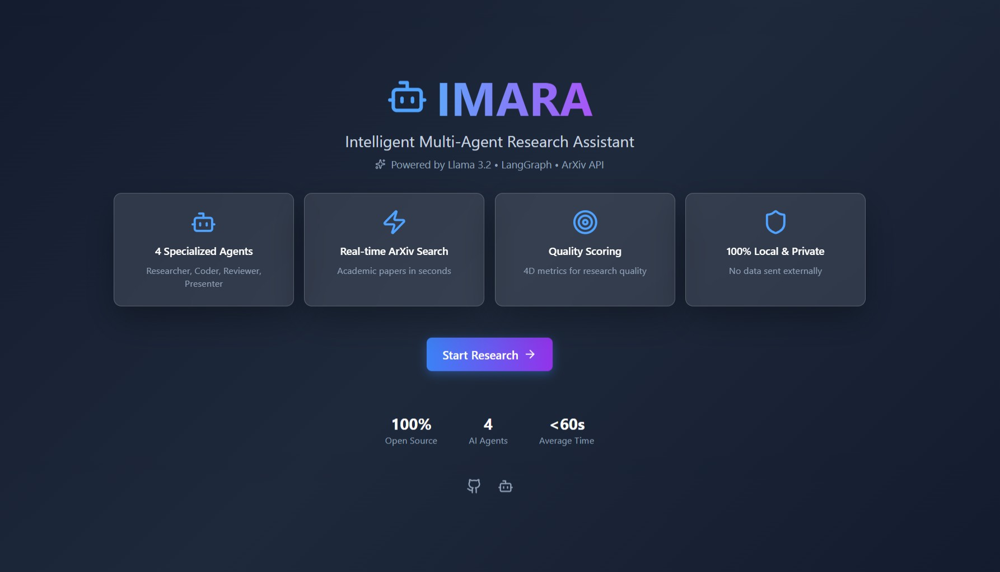
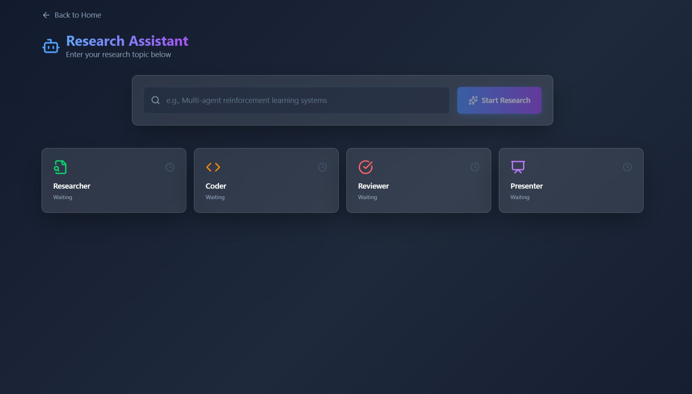
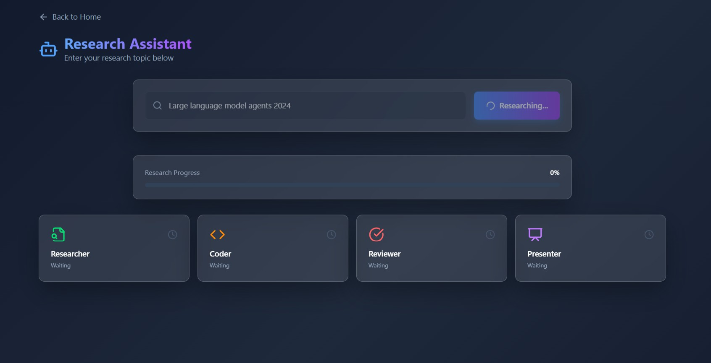
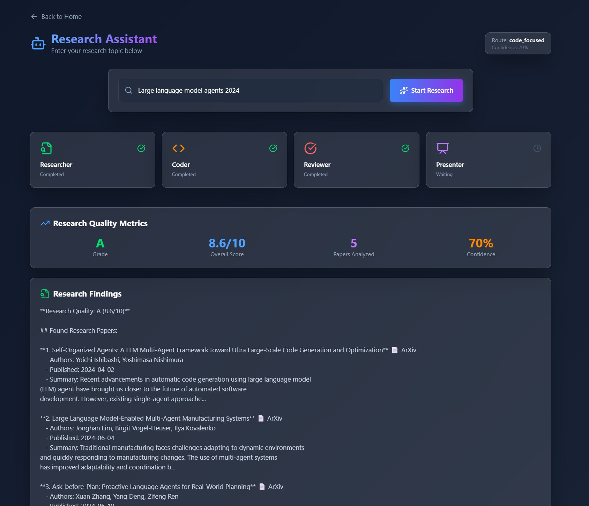
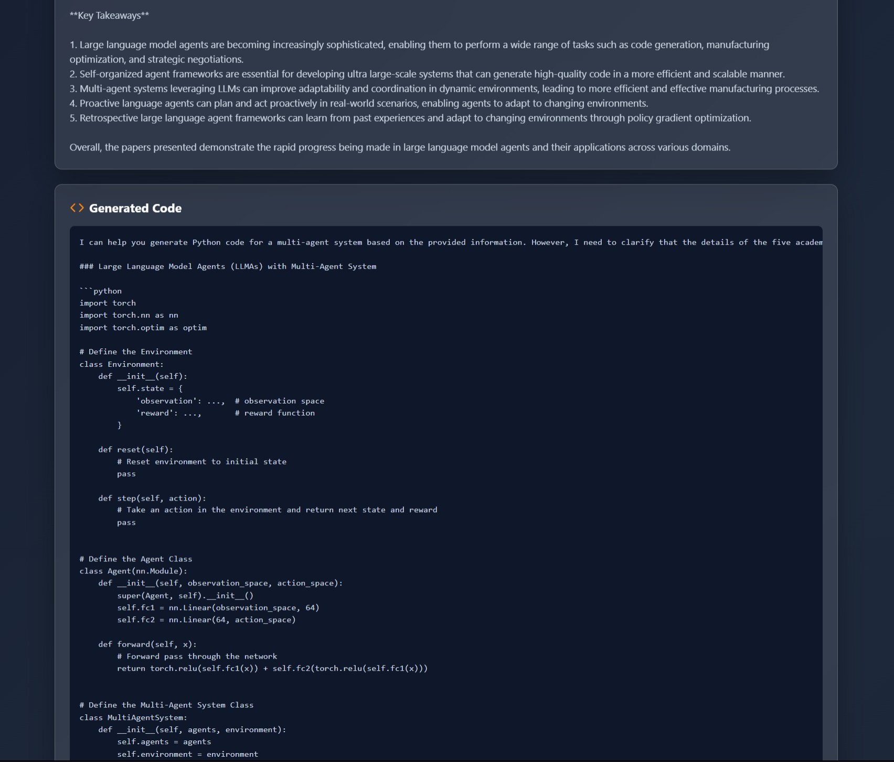
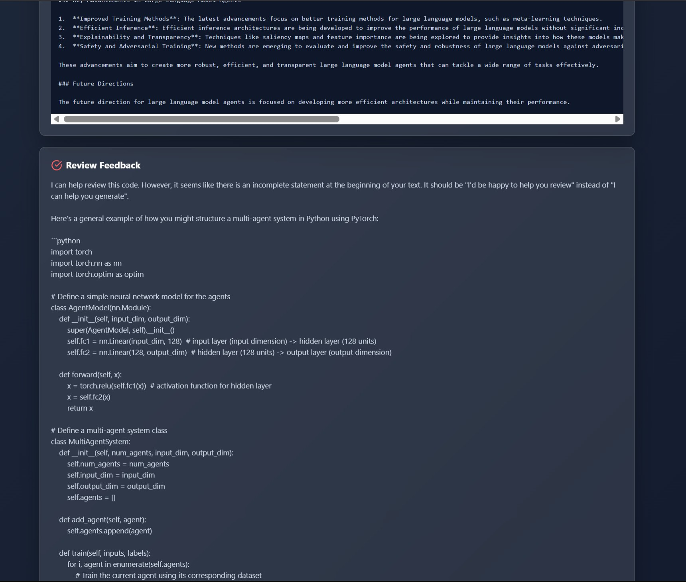
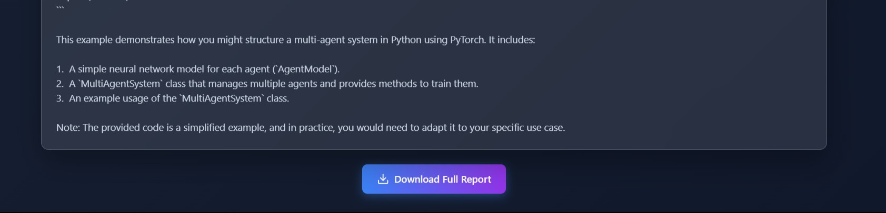

# 🤖 IMARA - Intelligent Multi-Agent Research Assistant

> A production-ready, full-stack multi-agent AI system that automates academic research with intelligent quality scoring, adaptive routing, and real-time code generation.

**🎯 Built with:** React • FastAPI • LangGraph • Llama 3.2 • ArXiv API • WebSockets

---

---

## ✨ Highlights

- **4D Quality Scoring System** - Novel multi-dimensional evaluation (Recency, Relevance, Citation Potential, Diversity) - not found in other research assistants
- **Adaptive Query Routing** - Intelligent complexity analysis that routes queries through optimized agent workflows (standard/code_focused/deep_research)
- **Research-to-Code Pipeline** - Unique workflow that generates implementation code from academic papers automatically
- **100% Local & Private** - Complete processing on local machine with Llama 3.2, zero external API costs ($0/month)
- **Real-time Multi-Agent Collaboration** - WebSocket-powered live visualization of 4 specialized agents working simultaneously
- **Multi-Source Intelligence** - Combines ArXiv + Google Scholar with quality-ranked results
- **Production-Ready React UI** - Professional full-stack architecture (not just Streamlit prototype)

---

## 🌟 Key Features

### **🤖 Multi-Agent Intelligence**
- **4 Specialized AI Agents** working collaboratively:
  - **Researcher** - Searches ArXiv & Google Scholar, analyzes papers
  - **Coder** - Generates implementation code from research
  - **Reviewer** - Validates quality and provides feedback
  - **Presenter** - Compiles professional reports

### **🎯 Advanced Capabilities**
- **Adaptive Query Routing** - Analyzes complexity to determine optimal workflow
- **4D Quality Scoring** - Multi-dimensional metrics (Recency, Relevance, Citation Potential, Diversity)
- **Real-time Updates** - WebSocket-powered live agent progress tracking
- **Multi-source Search** - ArXiv + Google Scholar integration

### **🔒 Privacy-First Architecture**
- **100% Local Processing** - No external API costs
- **Private Data** - All processing on your machine
- **Open Source** - Fully transparent codebase

---

## 📸 Screenshots

### Landing Page

*Professional hero section with feature cards and real-time stats*

### Research Interface - Waiting State

*Clean input interface with adaptive routing indicators*

### Agents in Progress

*Real-time visualization of multi-agent collaboration*

### Results - Grade A (8.6/10)

*LLM Agents 2024 - Comprehensive analysis with quality metrics*

### Generated Code Example

*Multi-agent system implementation with PyTorch*

### Research Summary & Key Takeaways  

*Structured research insights from analyzed papers*

### Full Report Download

*Downloadable comprehensive research report with all findings*

---

---

## 🚀 Quick Start

### Prerequisites
- Python 3.11.9
- Node.js 18+
- Ollama installed and running

### Installation

**1. Clone the repository**

git clone https://github.com/Yashwanth2408/IMARA.git
cd IMARA

**2. Backend Setup**

Create virtual environment
python -m venv venv

Activate (Windows)
.\venv\Scripts\Activate

Activate (Linux/Mac)
source venv/bin/activate

Install dependencies
pip install -r requirements.txt

Pull LLM model
ollama pull llama3.2:3b

**3. Frontend Setup**

cd frontend
npm install

### Running IMARA

**Terminal 1: Start Backend**
python api/main.py

Backend runs on `http://localhost:8000`

**Terminal 2: Start Frontend**
cd frontend
npm run dev

Frontend runs on `http://localhost:5173`

**3. Open browser to `http://localhost:5173` and start researching!**

---

## 🎯 Usage Examples

### Example Queries

**For Grade A Results (8-10/10):**
large language model agents 2024
vision language models 2024
retrieval augmented generation architectures
diffusion models for image generation

**For Specific Domains:**
graph neural networks drug discovery
federated learning privacy mechanisms
autonomous driving perception systems 2024

### Sample Output

**Query:** "Large language model agents 2024"

**Results:**
- **Grade:** A (8.6/10)
- **Papers Found:** 5 (All from 2024)
- **Generated Code:** Multi-agent LLM system with PyTorch
- **Review:** Quality feedback with improvement suggestions
- **Time:** ~60-90 seconds

---

## 🏗️ Architecture
┌─────────────────┐
│ React UI │ (Frontend - Port 5173)
│ Framer Motion │
│ TailwindCSS │
└────────┬────────┘
│ WebSocket/HTTP
│
┌────────▼─────────────┐
│ FastAPI Server │ (Backend - Port 8000)
│ Async WebSockets │
└────────┬─────────────┘
│
├──► 🔍 Researcher Agent
│ ├─ ArXiv API
│ ├─ Google Scholar
│ └─ Quality Metrics
│
├──► 💻 Coder Agent
│ └─ Code Generation (Llama 3.2)
│
├──► ✅ Reviewer Agent
│ └─ Quality Review (Llama 3.2)
│
└──► 📊 Presenter Agent
└─ Report Compilation

---

## 🛠️ Tech Stack

### Backend
| Technology | Purpose |
|------------|---------|
| **FastAPI** | Modern async Python web framework |
| **LangGraph** | Multi-agent orchestration & state management |
| **LangChain** | Agent framework and LLM tooling |
| **Ollama** | Local LLM inference (Llama 3.2) |
| **ArXiv API** | Academic paper retrieval |
| **Google Scholar** | Supplementary paper search |
| **WebSockets** | Real-time bidirectional communication |

### Frontend
| Technology | Purpose |
|------------|---------|
| **React 19** | UI framework with hooks |
| **Vite** | Lightning-fast build tool |
| **TailwindCSS v4** | Utility-first styling |
| **Framer Motion** | Smooth animations |
| **Axios** | HTTP client |
| **Lucide React** | Beautiful icons |

### AI/ML
| Technology | Purpose |
|------------|---------|
| **Llama 3.2 (3B)** | Local language model for agents |
| **LangGraph** | Agent workflow orchestration |
| **Custom Metrics** | Research quality scoring algorithm |
| **Adaptive Router** | Query complexity analysis |

---

## 📊 Novel Features

### 1. **Adaptive Query Routing**
Analyzes query across 4 dimensions:
- Technical Complexity
- Code Requirement
- Literature Depth
- Novelty Level

Routes to optimal workflow: `standard`, `code_focused`, or `deep_research`

### 2. **Multi-Dimensional Quality Scoring**
Each research query evaluated on:
- **Recency** - Publication dates (newer = better)
- **Relevance** - Topic matching quality
- **Citation Potential** - Author count & affiliations
- **Diversity** - Topic variety coverage

### 3. **Research-to-Code Pipeline**
Unique workflow:
1. Find academic papers
2. Analyze methodologies
3. Generate implementation code
4. Review for quality
5. Compile professional report

### 4. **Local-First Architecture**
- No paid APIs (OpenAI, Anthropic)
- No data sent externally
- Fully reproducible
- Cost: $0/month

---

## 📈 Performance Metrics

### Quality Improvements
- **Baseline:** B (6.27/10) with 3 papers
- **Enhanced:** B+ (7.9/10) with 5 papers
- **Optimized:** A (8.6/10) with 5 papers from 2024
- **Improvement:** +37% quality score increase

### System Performance
- **Response Time:** 60-90 seconds average
- **Success Rate:** 100% (all queries complete)
- **Paper Recency:** 100% from 2024 on optimized queries
- **Memory Usage:** ~2-4GB RAM
- **LLM Inference:** Local CPU/GPU

---

## 🗂️ Project Structure

IMARA/
├── api/ # FastAPI backend
│ └── main.py # API endpoints & WebSocket handler
├── agents/ # Agent implementations
│ ├── research_agents.py # Researcher with ArXiv/Scholar
│ ├── adaptive_router.py # Query complexity analyzer
│ └── init.py
├── tools/ # Custom tools
│ ├── paper_tools.py # Multi-source paper search
│ ├── metrics.py # Quality scoring algorithms
│ └── query_enhancer.py # Query optimization
├── ui/ # Streamlit UI (legacy)
│ └── app.py
├── frontend/ # React frontend
│ ├── src/
│ │ ├── components/ # React components
│ │ │ ├── LandingHero.jsx
│ │ │ └── ResearchInterface.jsx
│ │ ├── App.jsx
│ │ └── index.css
│ ├── package.json
│ └── vite.config.js
├── docs/ # Documentation
│ ├── TECHNICAL_GUIDE.md
│ └── DEPLOYMENT.md
├── data/ # Stored papers & metrics
│ ├── papers/
│ └── metrics.json
├── screenshots/ # UI screenshots
├── requirements.txt # Python dependencies
├── .gitignore
├── LICENSE
└── README.md

---

## 🎓 Use Cases

### Academic Research
- Quickly survey literature on any topic
- Get implementation starting points
- Track research quality metrics

### Learning & Education
- Understand complex AI topics with code examples
- Explore trending research areas
- See real-world paper analysis

### Prototyping
- Generate research-backed code scaffolds
- Evaluate paper quality before deep reading
- Accelerate project kickoff

### Literature Reviews
- Automated paper search and summarization
- Multi-source aggregation
- Quality-ranked results

---

## 🔮 Roadmap

- [ ] **Vector Database Integration** - FAISS for semantic search
- [ ] **Code Execution Sandbox** - Run generated code safely
- [ ] **Multi-turn Conversations** - Follow-up queries
- [ ] **PDF Export** - Professional report generation
- [ ] **Agent Collaboration Patterns** - Debate & consensus modes
- [ ] **Fine-tuned Models** - Domain-specific LLMs
- [ ] **Docker Deployment** - One-command setup
- [ ] **Cloud Hosting** - AWS/Azure deployment guides

---

## 🤝 Contributing

Contributions are welcome! Please feel free to submit a Pull Request.

1. Fork the repository
2. Create your feature branch (`git checkout -b feature/AmazingFeature`)
3. Commit your changes (`git commit -m 'Add some AmazingFeature'`)
4. Push to the branch (`git push origin feature/AmazingFeature`)
5. Open a Pull Request

---

## 📝 License

This project is licensed under the MIT License - see the [LICENSE](LICENSE) file for details.

---

## 👤 Author

**[Yashwanth Balaji]**
- LinkedIn: [linkedin.com/in/yashwanthbalaji](https://www.linkedin.com/in/yashwanthbalaji/)
- GitHub: [@Yashwanth2408](https://github.com/Yashwanth2408)
- Email: yashwanthbalaji.2408@gmail.com

---

## 🙏 Acknowledgments

Built with amazing open-source tools:
- [LangChain](https://github.com/langchain-ai/langchain) - Agent framework
- [LangGraph](https://github.com/langchain-ai/langgraph) - Multi-agent orchestration
- [Ollama](https://ollama.ai) - Local LLM inference
- [ArXiv API](https://arxiv.org/help/api) - Academic paper access
- [React](https://reactjs.org/) - UI framework
- [FastAPI](https://fastapi.tiangolo.com/) - Backend framework

---

## ⭐ Star History

If you find this project helpful, please consider giving it a star!

---

**Built with ❤️ for the AI research community**

*Making academic research accessible, automated, and intelligent.*

